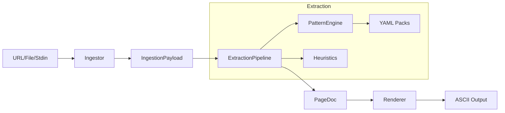

# DAGifier Architecture

This document describes the internal structure and data flow of DAGifier.

## Overview

DAGifier is built as a modular pipeline to ensure extensibility and testability. It translates unstructured HTML into a structured `PageDoc` representation, which is then rendered as ASCII.

## High-Level Data Flow

## Core Components

### 1. Ingestor (`src/core/ingestor.ts`)
- Responsible for fetching raw data.
- Handles `axios` configuration (including User-Agent spoofing for Reddit).
- Detects MIME types and normalizes binary/text input into a canonical `IngestionPayload`.

### 2. Pattern Engine (`src/core/patterns.ts`)
- Loads YAML-based "Pattern Packs" from the `patterns/` directory.
- Matches domains to specific rule sets (root selectors, author paths, etc.).
- Manages `site-state.json` persistence for session-to-session memory.

### 3. Extraction Pipeline (`src/core/pipeline.ts`)
- The brain of the tool.
- Performs recursive DOM traversal using `node-html-parser`.
- Implements a specific "threaded extraction" algorithm for comment structures.
- Generates the `Trace` object for `--explain` diagnostics.

### 4. Renderer (`src/core/renderer.ts`)
- Decoupled from extraction.
- Maps `ContentBlock` types to ASCII visual patterns.
- Handles line wrapping and nested framing (threaded blocks).

## Data Models

### `PageDoc`
The intermediate representation of a document:
- `title`: Extracted title.
- `url`: Optional source URL.
- `content`: An array of `ContentBlock` objects.
- `metadata`: Ingestion details and used packs.

### `ContentBlock`
Can be of type:
- `text`: Plain paragraph.
- `heading`: Structural header (h1-h6).
- `link`: text/url pair.
- `thread-item`: Nested comment block with author, body, and children.

## Design Patterns

- **Strategy Pattern**: Pattern Packs allow per-site strategies without changing core pipeline code.
- **Trace Signal Pattern**: Every decision in the pipeline adds to a `Trace` list, enabling easy debugging of complex extractions.
