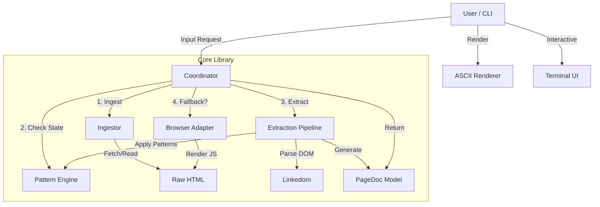

# Architecture

> Last updated: 2026-02-17

## Overview

Dagifier is a CLI-first tool designed to convert modern, complex web pages into clean, readable ASCII Directed Acyclic Graphs (DAGs). It prioritizes low-bandwidth consumption and high readability, making it ideal for LLM context injection and terminal-based reading.

The system follows a **"Thin CLI, Fat Core"** architecture, where the core business logic is encapsulated in a reusable library, and the CLI acts as a lightweight interface.

---

## Tech Stack

| Component | Technology | Purpose |
| :--- | :--- | :--- |
| **Runtime** | Node.js (TypeScript) | Core execution environment |
| **CLI Framework** | Commander.js | Command parsing and help generation |
| **HTML Parsing** | Linkedom | Lightweight, DOM-compatible parsing |
| **Rendering** | Playwright (Headless) | Fallback for JS-heavy sites |
| **TUI** | Readline | Interactive terminal interface |
| **Styling** | Chalk / Wrap-Ansi | Terminal formatting and line wrapping |

---

## System Design



### Core Components

#### 1. Coordinator (`src/core/coordinator.ts`)
The central nervous system of Dagifier. It orchestrates the ingestion process:
- Determines whether to use simple `fetch` or the heavy `Playwright` browser based on content "thinness" or stored domain state.
- Manages the "Fallback Ladder" (Try fast -> Fail -> Try heavy).
- Persists success/failure metrics to `~/.dagifier/site-state.json`.

#### 2. Pattern Engine (`src/core/patterns.ts`)
A rule-based engine that loads YAML "Pattern Packs" to understand specific website structures.
- **Selectors**: Defines how to find the root content, items, author names, etc.
- **Persistence**: Remembers which provider (`fetch` vs `playwright`) worked last for a domain to speed up future runs.

#### 3. Extraction Pipeline (`src/core/pipeline.ts`)
Converts raw HTML into the canonical `PageDoc` format.
- **heuristics**: Auto-detects content if no pattern pack exists (using Mozilla Readability logic).
- **Transformation**: Flattens nested HTML into a linear or threaded list of `ContentBlock`s.

#### 4. ASCII Renderer (`src/core/renderer.ts`)
Takes a `PageDoc` and paints it to the terminal.
- **Thread Rendering**:Visualizes nested conversations using tree characters (`┌─`, `│`, `└─`).
- **Block Formatting**: Handles word wrapping, indentation, and element styling (quotes, code blocks).

---

## Data Model: PageDoc

The `PageDoc` is the canonical representation of any page, whether it's a blog post, a Reddit thread, or a documentation site.

```typescript
interface PageDoc {
  title: string;
  url?: string;
  author?: string;
  
  // The type of content dictates how it's rendered
  kind: 'article' | 'thread' | 'mixed';
  
  // Flattened or recursive content blocks
  content: ContentBlock[];
  
  // Metadata about the extraction itself
  meta: {
    source: 'url' | 'file' | 'stdin';
    provider: 'fetch' | 'playwright';
    executionTime: number;
  };
}
```

---

## Key Design Decisions

### 1. Hybrid Extraction Strategy
**Decision:** Attempt cheap static analysis (`fetch`) first, then fallback to expensive dynamic rendering (`Playwright`).
**Rationale:** 90% of "reading" content is statically available. Always launching a browser is too slow and resource-intensive. However, ignoring JS-heavy sites limits utility. The hybrid approach gives the best of both worlds.

### 2. Canonical Data Model (`PageDoc`)
**Decision:** Decouple extraction from rendering via an intermediate JSON format.
**Rationale:** allows the same extraction logic to power a CLI, a web UI, or an LLM context injector. It also simplifies testing by allowing us to snapshot the _data_ separately from the _visual output_.

### 3. YAML Pattern Packs
**Decision:** Externalize site-specific logic into YAML files instead of hardcoding Switch statements.
**Rationale:** Enables users to add support for new sites without recompiling the tool. Facilitates sharing "packs" within the community.

### 4. Thin CLI Wrapper
**Decision:** The CLI (`src/cli.ts`) should contain almost no logic, only argument parsing.
**Rationale:** Makes the core library easy to embed in other tools (e.g., an MCP server or a VS Code extension) without carrying CLI baggage.

---

## Future Roadmap

- **MCP Server**: Expose Dagifier as a Model Context Protocol server for direct LLM integration.
- **Plugin System**: Allow JavaScript-based pattern packs for complex interactions (e.g., logging in).
- **Streaming**: Stream extraction results for very large pages.
